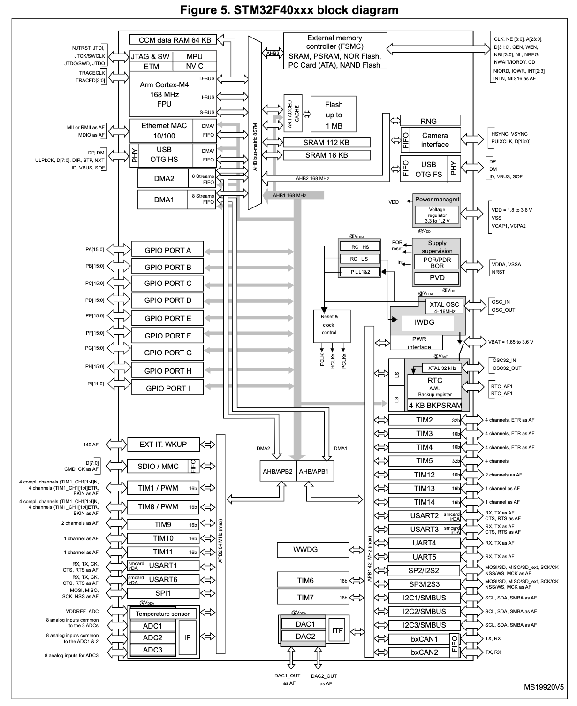
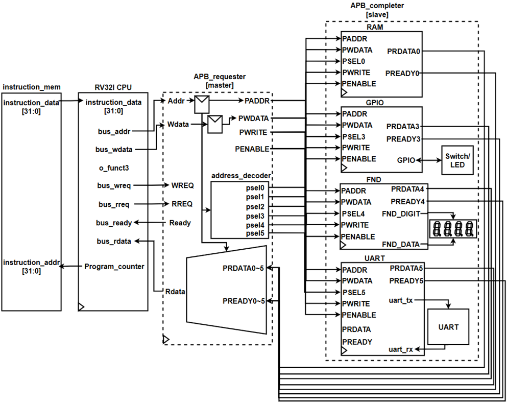
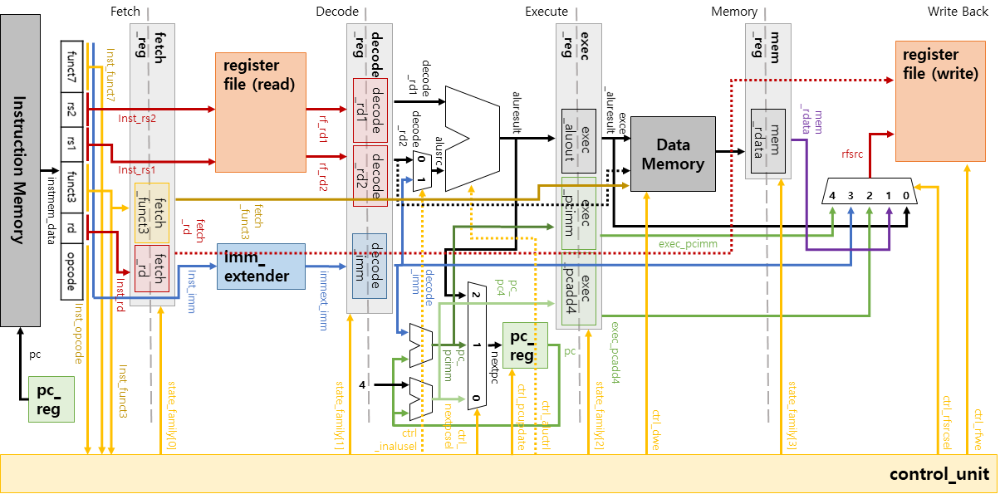

# MCU. 그런데 RV32I와 APB 인터페이스를 곁들인.
이 프로젝트는 RV32I CPU를 중심으로 여러 외부 장치들을 연결하여 하나의 **MCU**를 구현하는 프로젝트입니다.  
기간은 2026/03때 3주 정도?

## 어떤 방법들을 사용했을까요?
MCU를 구성하기 위해서는 *CPU* / *BUS Interface* / *Peripheral Cores*가 필요합니다.  
단적인 예시로, STM32 Family들은 엄청 많은 외부장치들을 가지고 있죠.  

### 그래서 저는 아래와 같은 구조로 구현하고자 합니다.

위 다이어그램은 다음과 같은 정보를 담는데요,  
- CPU는 RV32I ISA를 지원합니다
- 버스 인터페이스는 AMBA APB 입니다
- Peripheral로 RAM/FND/GPIO/UART가 있도록 구현했네요

### CPU 참 탐나지 않나요?
멀티사이클 CPU인데요, 한번 아래와 같은 구조로 만들어 봤습니다.  

한번 합성해보니, Artix-7 FPGA 기준으로 100MHz 클럭에서 합성이 잘 되었습니다.  
다만, **Execute Stage에서 PC Reg 업데이트 부분에 대한 부분이 Critical Path여서 Slack이 약 1.2ns 정도의 여유**밖에 없었네요..

## 어떤 환경에서 만들었어요?
Xilinx Vivado 2020.01 환경에서 합성하고 비트스트림을 생성하였으며  
Basys 3 보드에서 동작해봤습니다.
